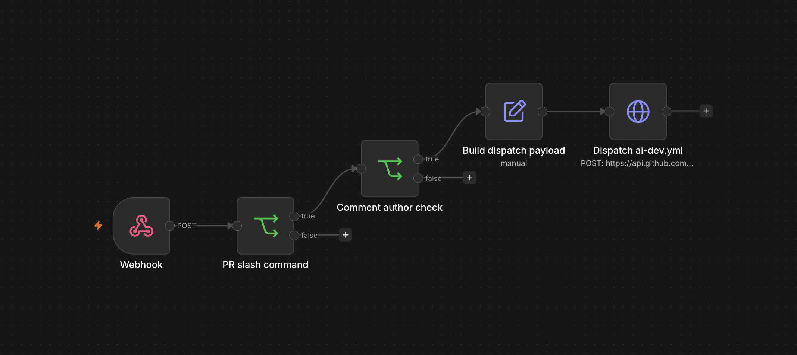
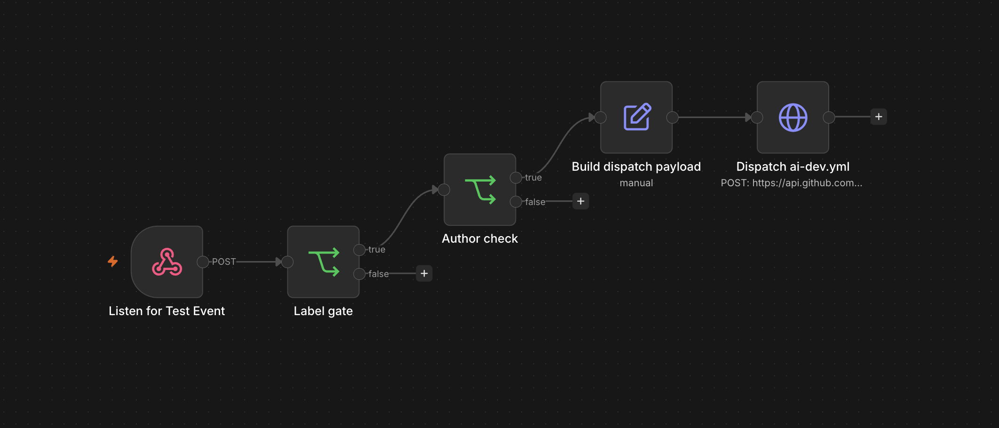
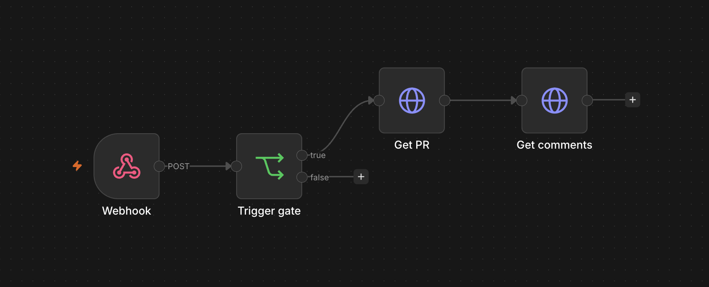

# Portfolio entry — Scrolloop AI 개발 파이프라인

zaewc.site에 붙이기 위한 짧은 형식과, 클릭해서 들어갈 수 있는 deep dive 두 가지 포함.

---

## 짧은 버전 (site의 사이드 프로젝트 항목에 그대로)

### Scrolloop — Multi-Agent AI 개발 자동화 파이프라인

GitHub 이슈에 `ai:*` 라벨링만으로 AI(Gemini)가 plan을 작성하고, 코드를 수정한 뒤, 자체 평가까지 마친 PR을 자동 생성하는 개발 자동화 파이프라인을 구축했습니다. n8n(webhook 검증·dispatch)과 GitHub Actions(격리 컨테이너 실행) 사이에 trust boundary를 두고, Planner / Generator / Evaluator 3-agent harness로 각 단계 산출물을 `.harness/<n>/plan.md` · `review.md`로 PR diff에 commit해 AI 결정 과정 전체를 추적 가능하게 설계했습니다. Gemini 무료 티어 일일 한도(20 RPD)와 학교 NAT의 MTU(1400) · Tailscale(1280) · Docker bridge(1500) 충돌을 model fallback chain과 bridge MTU 1280 고정으로 해결하며 운영 비용 \$0로 end-to-end 동작을 검증했습니다.

스택: n8n · GitHub Actions · Gemini API · Tailscale Funnel · Docker Compose · TypeScript

---

## 깊이 들어가는 버전 (블로그/케이스 스터디 페이지용)

### 0. tl;dr

- **목표**: GitHub 이슈에 라벨만 달면 AI가 plan → 코드 수정 → 자체 평가까지 끝낸 PR을 자동으로 만들어두는 시스템.
- **제약**: 안전해야 함 (AI에게 무한 권한 X). 무료여야 함 (학생 프로젝트). 격리되어야 함 (n8n에 코드 실행 신뢰 X).
- **결과**: n8n 워크플로우 3종 + GitHub Actions 3-agent harness + composite action + Tailscale Funnel로 공개 endpoint. 모든 컴포넌트 무료 티어 안에서 동작. end-to-end 라벨 트리거 검증 완료.

---

### 1. 출발점 — 왜 만들었나

scrolloop은 직접 만든 windowing 기반 가상 스크롤 OSS. turborepo 모노레포로 React / React Native / Preact / Vue / Svelte 5개 프레임워크 어댑터를 동시 지원하다 보니, 작은 기능 하나를 더해도 5곳에 손이 가는 구조입니다. 라이브러리 누적 다운로드는 2,000+건이지만 PR 처리 속도가 느려서 이슈 백로그가 쌓이는 게 답답했습니다.

가설: "이슈에 `ai:ready` + `ai:fix` 라벨만 달면 AI가 plan + 코드 수정 + 검증까지 마친 PR을 자동으로 올려두면, 사람은 리뷰만 하면 된다."

하지만 그냥 "n8n에 AI 시키기"로는 안 됩니다. AI가 직접 코드를 수정한다는 건:

- **secret 노출 위험**: AI가 토큰을 prompt에 노출시킬 수 있음
- **scope creep**: AI가 시킨 범위 밖의 파일까지 수정할 수 있음
- **무한 루프**: AI가 만든 PR에 AI 봇이 코멘트 → 또 AI가 처리 → ...
- **fork PR 공격**: 외부인이 PR 코멘트로 AI를 트리거하면 secret 유출

그래서 단순한 "n8n에 코드 시키기"가 아니라, **trust boundary가 명시적으로 설계된 시스템**이 목표였습니다.

---

### 2. 시스템 아키텍처 — trust boundary 명시 설계

```
GitHub Event (issue / PR comment / workflow_run)
        │
        ▼  (webhook over HTTPS, HMAC 서명 검증)
┌────────────────────────────────────────────┐
│  n8n   (Tailscale Funnel 공개 HTTPS)       │
│  - 이벤트 수신                              │
│  - 라벨 / 권한 / 봇 필터                    │
│  - prompt 합성                              │
│  - workflow_dispatch 호출                   │
└────────────────────────────────────────────┘
        │
        ▼  (GitHub PAT, repo:write/actions:write)
┌────────────────────────────────────────────┐
│  GitHub Actions    (ephemeral 격리 컨테이너) │
│  ─ Planner   → .harness/<n>/plan.md         │
│  ─ Generator → code edits + verify          │
│  ─ Evaluator → review.md + PR 코멘트         │
└────────────────────────────────────────────┘
        │
        ▼
   ai/issue-N branch  ──▶  Pull Request → develop
```

| 시스템         | 책임                                                                  | 권한                                                              |
| -------------- | --------------------------------------------------------------------- | ----------------------------------------------------------------- |
| n8n            | webhook 수신, 라벨/권한 검증, prompt 합성, workflow_dispatch          | GitHub PAT (issues/PR/actions 쓰기)                               |
| GitHub Actions | git checkout, AI 호출, 코드 수정, 검증(typecheck/lint/test/build), PR | repo scoped `GITHUB_TOKEN`, **`NPM_TOKEN` 없음**, `id-token` 없음 |

**핵심 원칙**: n8n은 **임의 코드 실행 환경으로 신뢰하지 않습니다**. 오케스트레이션 도구로서 편리하지만, 보안적으로는 "이벤트를 받고 → 검증하고 → GitHub Actions에 위임"이라는 read/dispatch-only 역할만 부여. 모든 코드 변경은 ephemeral Actions 컨테이너에서, 격리된 secret 범위로만 실행됩니다.

> "n8n에 AI 시키면 안 되나?" → n8n도 외부 노출 endpoint이고, 한 번 침해되면 전체 영향. 코드 실행을 GitHub Actions로 분리하면 침해 표면이 줄어들고, secret이 Actions 쪽에만 있어서 n8n 침해와 무관.

---

### 3. n8n 워크플로우 — webhook receiver 3종

n8n에 GitHub 이벤트를 받는 webhook 워크플로우 3개를 만들었습니다. 각각이 다른 이벤트 / 트리거를 다룹니다.

#### 3.1 Issue 워크플로우



이슈에 라벨이 달리면 시작. 노드 순서:

1. **Webhook** (POST `/webhook/scrolloop-issues`) — GitHub의 `issues` 이벤트 수신
2. **Label gate (If)** — 다음 조건을 한 번에 검사:
   - `ai:ready` 라벨 있음
   - `ai:blocked` 라벨 없음
   - `ai:dangerous` 라벨 없음
3. **Author check (If)** — 이슈 작성자가 `OWNER` / `MEMBER` / `COLLABORATOR` 중 하나
4. **Build dispatch payload (Set)** — 표현식으로 `task_type`, `issue_number`, `prompt` 합성. 라벨로 분류:
   - `ai:plan` → `task_type=plan`
   - `ai:fix` → `task_type=bugfix`
   - `ai:test` / `ai:docs` → 그대로
5. **Dispatch ai-dev.yml (HTTP Request)** — GitHub API `workflow_dispatch` POST. JSON body는 `JSON.stringify(...)`로 prompt의 `\n`을 안전하게 인코딩.

각 노드는 false branch로 빠지면 조용히 종료. 잘못된 이벤트(다른 라벨 / 외부인 / 봇 작성)는 거기서 끝납니다.

#### 3.2 PR 코멘트 워크플로우



PR에 슬래시 커맨드 코멘트가 달리면 시작:

- `/ai-plan`, `/ai-fix`, `/ai-test`, `/ai-docs`, `/ai-review` 5종 허용
- 그 외 코멘트는 모두 무시 (자연어 명령 받지 않음)

1. **Webhook** (POST `/webhook/scrolloop-pr-comments`) — `issue_comment` 이벤트 수신
2. **PR slash command (If)** — 정규식 `^\/ai-(plan|fix|test|docs|review)\b` 매치 + `issue.pull_request` 객체 존재(일반 이슈 코멘트 아닌 PR 코멘트)
3. **Comment author check (If)** — 코멘트 작성자 권한 검증
4. **Build dispatch payload (Set)** — 커맨드를 `task_type`으로 매핑 (`/ai-fix` → `bugfix`, `/ai-review` → `plan`), 코멘트 본문 + PR 컨텍스트로 prompt 합성
5. **Dispatch ai-dev.yml (HTTP Request)** — 동일한 endpoint 호출

#### 3.3 Apply review 워크플로우 (실험적)



`/ai-apply-review` 커맨드 전용. 일반 슬래시 커맨드와 다른 점: **PR에 달린 다른 사람 / 다른 AI 봇(Gemini Code Assist, CodeRabbit 등)의 코멘트까지 모두 수집**해서 한 번에 코드에 반영합니다.

1. **Webhook** + **Trigger gate (If)** — `/ai-apply-review` 매치 + 권한 + 봇 재귀 가드
2. **Get PR (HTTP GET)** — `GET /pulls/{n}` — PR의 `head.ref`(브랜치 이름) 획득
3. **Get comments (HTTP GET)** — `GET /issues/{n}/comments` — PR 본문 코멘트 전부 수집
4. (이후) Code 노드로 prompt 합성 + Dispatch ai-dev.yml (`head_branch` 입력으로 원래 PR 브랜치에 commit 추가)

핵심은 `head_branch`. ai-dev.yml에 idempotent checkout 로직을 넣어서, 기존 브랜치가 있으면 거기에 이어서 commit하고 PR이 자동 업데이트되도록 했습니다.

---

### 4. GitHub Actions ai-dev.yml — 3-agent harness

처음엔 단일 Gemini 호출로 "이슈 → PR" 한 번에 끝내려고 했지만, 두 가지 문제가 보였습니다:

- **환각**: AI가 plan을 세우는 동시에 코드를 수정하다 보니 plan에 없는 변경을 슬쩍 넣는 경우가 생김
- **검증 불가**: AI 결과물이 좋은지 나쁜지 사람이 모든 PR을 정독해야 함

브런치에서 본 harness engineering 글이 인상적이었습니다. Planner / Generator / Evaluator 3 agent로 책임을 분리하면 각 단계가 명확한 입출력을 가지고, 산출물이 파일로 남아서 추적 가능하다는 아이디어. 그대로 적용해봤습니다.

#### 4.1 Job 1 — Planner

```yaml
- name: Run Planner (Gemini)
  uses: ./.github/actions/gemini
  with:
    api_key: ${{ secrets.GEMINI_API_KEY }}
    prompt_file: .ai/prompt.txt
    output_file: .harness/${{ inputs.issue_number }}/plan.md
    models: ${{ vars.GEMINI_MODELS || 'gemini-2.5-flash,...' }}
    allow_rest_fallback: "true"
```

Planner 프롬프트는 명확히 read-only를 강제합니다:

> You are the PLANNER agent. ... DO NOT modify any files. If you call any file-edit tool, you fail.

출력 형식도 enforce:

```markdown
# Plan

## Goal (한 단락)

## Affected files (예상 경로 bullet)

## Steps (번호 매긴 구체 단계, 파일 경로 명시)

## Test plan (실행할 기존 테스트 + Generator가 추가할 새 테스트)

## Risks / unknowns

## Out of scope
```

산출물 `.harness/<n>/plan.md`는 artifact로 업로드 → 다음 job에 전달.

#### 4.2 Job 2 — Generator

`needs: plan`으로 Planner 완료 후 시작. artifact 다운로드 → plan.md 내용을 prompt에 inject:

> You are the GENERATOR agent. Implement EXACTLY the plan at `.harness/<n>/plan.md`. ... If the plan is ambiguous, do the MINIMAL safe interpretation and leave a TODO comment. Do not invent new scope.

이후:

- `--yolo` 모드로 Gemini가 도구 호출(파일 읽기/쓰기) 자동 승인
- 코드 수정 완료 후 verify step: `pnpm typecheck` / `lint` / `test` / `build` 순차 실행, 실패 시 워크플로우 fail
- plan.md를 commit에 포함, 코드 변경분과 함께 push
- `gh pr create` 또는 (이미 PR 있으면) `gh pr edit`로 PR 본문 갱신

`task_type=plan` 모드면 Generator는 plan.md만 commit하고 코드 수정 없이 PR을 엽니다.

#### 4.3 Job 3 — Evaluator

`needs: [plan, implement]`로 둘 다 끝난 뒤 시작. `task_type=plan`이면 skip.

```yaml
- name: Compute diff vs develop
  run: |
    git fetch origin develop
    git diff origin/develop...HEAD > .ai/diff.patch
```

Evaluator는 plan.md + diff.patch를 prompt에 inject받고 평가만 합니다:

> You are the EVALUATOR agent. ... Compare implementation to plan. ...
> Required output:
>
> ## Verdict (PASS | NEEDS_CHANGES | BLOCKED)
>
> ## Plan vs implementation
>
> ## Concerns
>
> ## Verification observations

Verdict별 동작:

- `PASS` → 워크플로우 success, PR 코멘트로 review.md 게시
- `NEEDS_CHANGES` → 코멘트만 게시(워크플로우는 success). 사람이 리뷰
- `BLOCKED` → 워크플로우 실패 처리

Evaluator도 파일 수정 시도가 있을 수 있으니, 실행 후 `git checkout -- .` + `git clean -fd`로 review.md만 남기고 다 revert. 그 다음 `.harness/<n>/review.md`를 commit + push.

#### 4.4 산출물 traceability

PR diff에 모든 산출물이 보입니다:

```
+ .harness/42/plan.md       ← Planner가 만든 계획
+ packages/core/src/...     ← Generator가 만든 코드 변경
+ .harness/42/review.md     ← Evaluator의 평가
```

리뷰어는 한 PR에서 "AI가 뭘 하기로 했고 → 뭘 했고 → 자기 평가는 어땠는지"를 시간 순으로 추적할 수 있습니다.

---

### 5. Composite GitHub Action — Gemini fallback chain

3개 job이 모두 Gemini를 호출하지만 호출 패턴(인자, fallback 로직)이 같으니 [.github/actions/gemini/action.yml](../.github/actions/gemini/action.yml)로 분리했습니다.

```yaml
jobs:
  plan:
    steps:
      - uses: ./.github/actions/gemini
        with:
          prompt_file: .ai/prompt.txt
          output_file: .harness/<n>/plan.md
          models: gemini-2.5-flash,gemini-2.5-flash-lite,gemini-2.0-flash-lite
          allow_rest_fallback: "true"
```

action 내부:

1. `npm install -g @google/gemini-cli` (캐싱)
2. `MODELS_CSV`를 순회하면서 CLI 시도
   - 429 quota → 다음 모델
   - 그 외 에러 → 즉시 중단
3. CLI 전부 실패 + `allow_rest_fallback=true`면 REST API 직접 호출 시도 (CLI 우회)

Planner / Evaluator는 read-only라 REST fallback 의미가 있지만, Generator는 agentic이라 REST fallback 의미가 없어서 끔.

---

### 6. 인프라 — n8n 셀프호스팅 + 공개 endpoint

#### 6.1 환경

- Ubuntu 22.04 머신 (학교 네트워크 안쪽)
- Docker Compose로 n8n 단일 컨테이너 + SQLite 영속화
- Basic Auth + `N8N_BLOCK_FILE_ACCESS_TO_N8N_FILES=true`로 기본 보안
- secret은 `.env`(N8N_ENCRYPTION_KEY)에만, GitHub PAT은 n8n credential store에 별도 등록

#### 6.2 공개 HTTPS — Tailscale Funnel 선택

처음엔 Caddy로 Let's Encrypt 발급받으려 했는데, 학교 NAT가 표준 80/443을 차단하고 30000~39999 범위 비표준 포트만 외부 매핑 허용. Let's Encrypt HTTP-01 챌린지는 `n8n.zaewc.site:80`이 도달 가능해야 하는데 그게 불가.

대안 검토:

- **Cloudflare Tunnel**: zaewc.site DNS를 가비아 → Cloudflare로 NS 이전 필요. 다른 서비스 영향 가능성.
- **Tailscale Funnel**: DNS 이전 없이 `*.ts.net` 도메인으로 즉시 가능. 도메인 모양이 다르지만 GitHub Webhook은 URL만 보고 호출하므로 무관.

Tailscale Funnel을 선택. cloudflared 같은 추가 컨테이너 없이 `tailscale funnel --bg 5678`만으로 공개 HTTPS endpoint 확보 (`https://n8n-scrolloop.taila4171b.ts.net`).

#### 6.3 Idempotent setup script

`infra/n8n/setup.sh`로 호스트 셋업 자동화:

- Docker 없으면 `get.docker.com` 설치
- `.env` 없으면 `openssl rand`로 N8N_ENCRYPTION_KEY 생성, Basic Auth password 자동 생성 (1회 출력)
- `docker compose up -d` + healthcheck 폴링

스크립트 한 줄로 호스트 셋업 끝. 재실행해도 안전.

---

### 7. 디버깅 — root-cause 추적

가장 시간이 오래 걸린 두 버그.

#### 7.1 MTU mismatch — "connection timed out"

**증상**: n8n에서 GitHub workflow_dispatch로 POST 보내면 매번 "connection timed out". 같은 컨테이너에서 `wget https://api.github.com/rate_limit` 같은 작은 GET은 정상.

**일관성 없는 실패**가 단서였습니다. 어떤 요청은 통과하고 어떤 요청은 막히면 ▶ 페이로드 크기가 의심됨.

확인:

```
host eth0    MTU 1400   ← 학교 NAT
docker0      MTU 1500   ← Docker 기본
tailscale0   MTU 1280   ← Tailscale Funnel
```

n8n 컨테이너가 1500-byte 프레임을 만들어서 보내면 eth0(1400) 통과 못 함 → fragmentation → DF(don't fragment) 플래그면 drop, 일부 환경은 silent drop.

수정 한 줄:

```yaml
networks:
  default:
    driver_opts:
      com.docker.network.driver.mtu: "1280"
```

근본 원인을 워크플로우 주석에 보존해서 미래의 나(혹은 다른 협업자)가 "왜 1280?" 안 묻게 했습니다:

```yaml
# MTU pinned to 1280 because (a) the school NAT's eth0 only carries 1400-byte
# frames and (b) Tailscale's tailscale0 interface is 1280. Without this,
# Docker's default 1500-byte bridge fragments large outbound POSTs (e.g.
# n8n -> api.github.com workflow_dispatch) and they get silently dropped...
```

#### 7.2 Gemini CLI 내부 모델 routing

**증상**: `GEMINI_MODEL=gemini-2.5-flash-lite`로 설정했는데 에러 메시지는 `gemini-2.5-flash`의 일일 한도(20 RPD) 초과를 가리킴.

추론: Gemini CLI가 내부 라우팅 / 요약 / context 압축 용도로 `gemini-2.5-flash`를 항상 호출. `--model` 인자는 메인 응답에만 적용되고 내부 호출에는 영향 없음.

해결: composite action에서 두 단계 fallback. CLI 전부 실패하면 REST API 직접 호출로 CLI 자체를 우회. Plan/Evaluate처럼 텍스트 생성만 필요한 phase는 REST로 충분히 대체 가능.

#### 7.3 Actions PR 생성 권한 차단

**증상**: ai-dev.yml에서 `gh pr create` → "GitHub Actions is not permitted to create or approve pull requests".

원인: 저장소 Settings → Actions → Workflow permissions의 "Allow GitHub Actions to create and approve pull requests" 토글이 기본 OFF. PR 생성 기능 활성화 필요.

수정: 한 줄 API.

```bash
gh api -X PUT repos/zaewc/scrolloop/actions/permissions/workflow \
  -f default_workflow_permissions=write \
  -F can_approve_pull_request_reviews=true
```

다만 같은 토글이 "approve" 권한도 함께 켜는 점은 주의. 워크플로우 코드에 `gh pr review` / `gh pr merge`를 절대 넣지 않는 것으로 우회.

---

### 8. 보안 모델

| 영역                | 정책                                                                                          |
| ------------------- | --------------------------------------------------------------------------------------------- |
| fork PR             | 절대 거부 (`pull_request.head.repo.fork === true`)                                            |
| 작성자              | `OWNER` / `MEMBER` / `COLLABORATOR` 화이트리스트, `CONTRIBUTOR`는 제외                        |
| 봇 재귀             | `[bot]` 작성자 코멘트는 무시 (자기 자신 코멘트로 트리거되지 않게)                             |
| webhook 검증        | `X-Hub-Signature-256` HMAC 검증 (next iteration)                                              |
| 시크릿 저장         | n8n credentials store(`N8N_ENCRYPTION_KEY`로 암호화), `.env`엔 안 둠                          |
| 보호 파일           | `.github/workflows/cd.yml`, `.env*`, `*.pem`, `*.key`, `secrets.yml`, npm 토큰 관련 모두 차단 |
| publish 권한        | Actions에 `id-token` 없음, `NPM_TOKEN` env 안 줌 → AI가 npm publish 시도 자체 불가            |
| 자동 머지           | 절대 금지. 모든 PR은 사람 검토 후 수동 머지                                                   |
| 자연어 명령         | 거부. 슬래시 커맨드 화이트리스트만 인식                                                       |
| AI 출력 → 코드 수정 | Generator만 가능. Planner / Evaluator는 출력 후 `git checkout -- .`로 부수 효과 revert        |

---

### 9. 결과 + 검증

end-to-end 라벨 트리거 검증을 GitHub 이슈 #22로 수행:

1. `gh issue edit 22 --add-label ai:ready --add-label ai:plan`
2. GitHub Webhook → n8n production URL → 200 OK
3. n8n: 라벨 / 권한 / 봇 필터 통과 → workflow_dispatch
4. GitHub Actions ai-dev.yml: Planner 실행 → Gemini 호출 → plan.md 생성 → 워크플로우 끝까지 진행
5. (Gemini quota 회복 후 PR #50 plan-mode 검증 완료, Planner 산출물 품질 확인)

운영 비용:

- Tailscale Funnel: **\$0** (개인용 무료)
- Gemini API: **\$0** (Google AI Studio 무료 티어, gemini-2.5-flash + lite + 2.0-flash-lite)
- GitHub Actions: **\$0** (public repo 무료 분량 안에서)
- 호스트: **\$0** (학교에서 제공)

규모:

- n8n 워크플로우: **3개** (Issue / PR comment / Apply review)
- GitHub Actions: **1개 workflow + 1 composite action**
- 설계 / 운영 문서: **4개** (`docs/ai-pipeline.md`, `docs/ai-dev-prompt-template.md`, `infra/n8n/README.md`, 본 portfolio entry)
- 코드 / 설계 모두 [public repository](https://github.com/zaewc/scrolloop) 공개

---

### 10. 회고

**잘 한 것**

- **trust boundary 명시 설계**: n8n과 GitHub Actions를 처음부터 분리했더니, 이후 "어디까지 신뢰하나?" 같은 의사결정이 자명해짐. 보안 리뷰가 쉬워졌습니다.
- **3-agent harness**: 책임 분리로 환각 줄어들고, 산출물이 PR diff에 남아서 사람 리뷰가 빨라짐. 단순 단일 호출 대비 큰 가치.
- **composite action으로 재사용**: 처음엔 3 job에 Gemini fallback 로직 복붙했다가 분리. 다음에 비슷한 패턴(예: CI 실패 요약 워크플로우) 만들 때 1줄로 끝.
- **MTU 디버깅**: "GitHub 토큰 문제"로 의심하고 한참 헤맸는데, 결국 일관성 없는 실패 패턴이 단서가 됐음. 표면 증상에서 멈추지 않고 root cause까지 추적한 게 좋은 경험.

**다음에 다르게 할 것 / 미완성**

- **webhook HMAC 검증**: 현재는 작성자 화이트리스트만. GitHub Secret을 webhook에 설정하고 n8n에서 `X-Hub-Signature-256` 검증하는 노드를 추가하면 더 안전. (TODO)
- **CI 실패 자동 코멘트 워크플로우**: n8n에 webhook 등록 + log 요약 + PR 코멘트하는 4번째 워크플로우. 시작했다가 우선순위 밀어둠.
- **모니터링 / 알림**: dispatch 실패 시 (예: Gemini quota 전부 소진) 알림 없음. Discord webhook으로 알림 보내는 노드 추가 필요.
- **검증 자동화**: 매일 한 번 자동 dispatch + PR 생성까지 가는 smoke test 가 있으면 좋겠음. 현재는 수동.
- **n8n credential 안 쓰고 OIDC**: GitHub PAT 대신 GitHub App + OIDC로 가면 토큰 회전 신경 안 써도 됨.

---

### 11. 사용 기술

**오케스트레이션**: n8n 2.21 · GitHub Webhooks · GitHub Actions (workflow_dispatch, composite actions, artifact share)
**AI**: Google Gemini API (CLI + REST), gemini-2.5-flash / -lite / 2.0-flash-lite fallback chain
**인프라**: Ubuntu 22.04 · Docker Compose · Tailscale Funnel · SQLite
**언어 / 빌드**: TypeScript · pnpm · turborepo · vitest · Playwright
**보안**: HMAC 서명, author allowlist, secret 분리, MTU 고정, 봇 재귀 가드
